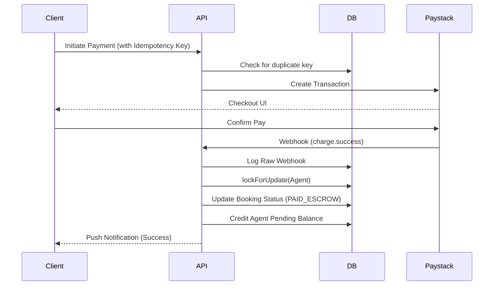
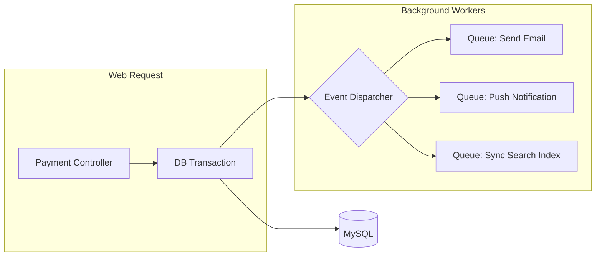

# Forafix - Home Services Marketplace

Forafix is a premium, real-time marketplace connecting clients with skilled professionals (Agents) for home services like cleaning, repairs, plumbing, and electrical work.

## ✨ Key Features

- **Dynamic Service Booking**: Seamless booking flow with real-time availability.
- **Paystack Integration**: Secure payments processed via Paystack with automated receipts.
- **Real-time Notifications**: Powered by Laravel Reverb (Pusher-compatible) for instant updates.
- **Premium UI/UX**: Full dark mode support, glassmorphism aesthetics, and responsive design.
- **Automated Communication**: Instant email confirmations via Mailtrap for successful bookings.

## 🚀 Getting Started

### Prerequisites

- PHP 8.2+
- Node.js & NPM
- MySQL
- [Mailtrap](https://mailtrap.io) account (for development emails)
- [Paystack](https://paystack.com) account (for payment processing)

### Installation

1. **Clone the repository:**
   ```bash
   git clone https://github.com/Chi-G/forafix-web.git
   cd forafix-web
   ```

2. **Install dependencies:**
   ```bash
   composer install
   npm install
   ```

3. **Environment Setup:**
   Copy `.env.example` to `.env` and configure your credentials:
   ```bash
   cp .env.example .env
   php artisan key:generate
   ```

4. **Database Configuration:**
   Run migrations and seeders:
   ```bash
   php artisan migrate --seed
   ```

5. **Configure Payment & Mail:**
   Add your keys to the `.env` file:
   ```env
   # Paystack
   PAYSTACK_PUBLIC_KEY=your_public_key
   PAYSTACK_SECRET_KEY=your_secret_key
   PAYSTACK_CALLBACK_URL=http://localhost:8000/payment/callback

   # Mailtrap
   MAIL_MAILER=smtp
   MAIL_HOST=sandbox.smtp.mailtrap.io
   MAIL_PORT=2525
   MAIL_USERNAME=your_username
   MAIL_PASSWORD=your_password
   ``` 

6. **Run the application:**
   ```bash
   # Terminal 1: Vite on dev server
   npm run dev

   # Terminal 2: PHP server
   php artisan serve

   # Terminal 3: Reverb server (WebSockets)
   php artisan reverb:start
   ```

## 🏗 Architecture & Reliability

Forafix is built for production-grade reliability, implementing high-integrity financial patterns.

### 🧩 System Components
- **Core API**: Laravel 12 / PHP 8.2
- **State Store**: MySQL 8+ (Transactional with Row Locking)
- **Async Processing**: Database-backed Queues for notifications.
- **Real-time**: Laravel Reverb for instant UI updates.
- **Documentation**: Swagger/OpenAPI 3.0.

### 🔄 Data & Signal Flows

#### 1. Escrow Payment Flow
Ensures funds are locked and verified before job commencement.


#### 2. Queue Architecture
Offloads slow tasks to maintain a responsive UI.


### 🛡 Data Integrity & Concurrency
- **Concurrency Control**: We use `lockForUpdate()` on financial records (User balances, Bookings) inside database transactions to prevent race conditions during parallel processing.
- **Idempotency**: All critical financial endpoints support idempotency keys to prevent double-charging on network retries.
- **Webhook Reliability**: Incoming webhooks are logged to a `webhook_logs` table before processing, allowing for manual replay and audit trails.
- **Ledger Integrity**: Every balance change is backed by an entry in the `transactions` table, providing a full audit log of money movement.

## 📖 API Documentation
Full API documentation is available via Swagger.
Run the following to view local docs:
```bash
php artisan l5-swagger:generate
```
Then visit: `http://localhost:8000/api/documentation`

---
Built with ❤️ by [Chi-G](https://github.com/Chi-G)
